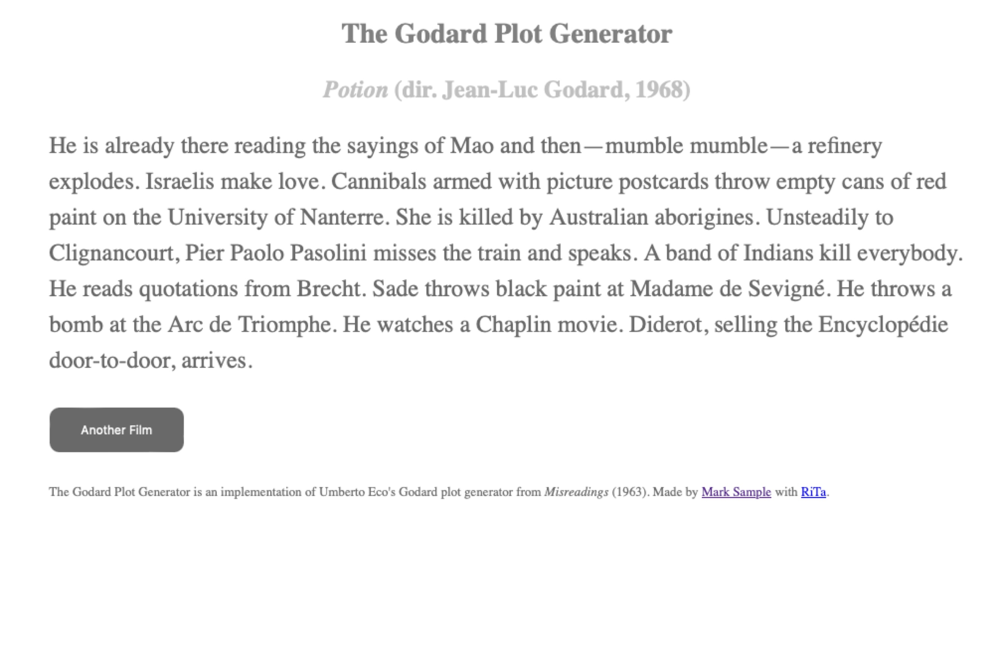

# Almost AI
## The Pleasure and Poetics of Remaining Human <br>in an Age of Machines

<small>*Mark Sample*  
*@samplereality.bsky.social*</small>

Note: speaker notes FTW!


<!-- .element: class="r-stretch" -->
<!-- Copper Engraving from *Briefe über den Schachspieler des Hrn. von Kempelen (1783)* -->


<!-- .element: class="r-stretch" -->


<!-- .element: class="r-stretch" -->


<!-- .element: class="r-stretch" -->


<!-- .element: class="r-stretch" -->


<!-- .element: class="r-stretch" -->


```DARLING SWEETHEART```  

```YOU ARE MY AVID FELLOW FEELING. MY AFFECTION CURIOUSLY CLINGS TO YOUR PASSIONATE WISH. MY LIKING YEARNS FOR YOUR HEART. YOU ARE MY WISTFUL SYMPATHY: MY TENDER LIKING.``` 

```YOURS BEAUTIFULLY```  
```M. U. C.```
<!-- .slide: style="text-align: left" -->


```JEWEL MOPPET```

```MY AFFECTION LUSTS FOR YOUR TENDERNESS. YOU ARE MY PASSIONATE DEVOTION: MY WISTFUL TENDERNESS. MY LIKING WOOS YOUR DEVOTION. MY APPETITE ARDENTLY TREASURES YOUR FERVENT HUNGER.``` 

```YOURS WINNINGLY```  
```M. U. C.```
<!-- .slide: style="text-align: left" -->


My - (adj.) - (noun) - (adv.) -  
(verb) - your - (adj.) - (noun).
<!-- .element: class="r-fit-text" -->


<!-- .element: class="r-stretch" -->


<!-- .element: class="r-stretch" -->


<!-- .element: class="r-stretch" -->


<section data-background-iframe="assets/Masterman - Use of Computers.pdf"
          data-background-interactive>
</section>


<!-- .element: class="r-stretch" -->


<!-- .element: class="r-stretch" -->



<!-- .element: class="r-stretch" -->


<!-- .element: class="r-stretch" -->


<section data-background-iframe="https://dearprofessor.glitch.me/"
          data-background-interactive>
</section>


<section data-background-iframe="https://fugitivetexts.net/dreamlab/zach/epicGenerator/index.html"
          data-background-interactive>
</section>


<section data-background-iframe="https://fugitivetexts.net/quarantine/"
          data-background-interactive>
</section>


<section data-background-iframe="https://weirdsatellites.tumblr.com/"
          data-background-interactive>
</section>


<!-- .element: class="r-stretch" -->


<!-- .element: class="r-stretch" -->


<section data-background-iframe="https://weirdsatellites.tumblr.com/"
          data-background-interactive>
</section>


<section data-background-iframe="assets/data.json"
          data-background-interactive
          data-background-color="white">
</section>


<section data-background-iframe="https://fugitivetexts.net/pandemicdreams/"
          data-background-interactive
          data-background-color="white">
</section>


<section data-background-iframe="https://fugitivetexts.net/pandemicdreams/assets/js/grammar.txt"
          data-background-interactive
        data-background-color="white">
</section>


The Stuplime
<!-- .element: class="r-fit-text" -->


<section data-background-iframe="https://fugitivetexts.net/pandemicdreams/"
          data-background-interactive
          data-background-color="white">
</section>


The day is hot, and  <!-- .element: class="r-fit-text" --> 


the weather, and the wars,  <!-- .element: class="r-fit-text" --> 


and the King, and the dukes.  <!-- .element: class="r-fit-text" --> 


It is no time to discourse.<!-- .element: class="r-fit-text" --> 


<section data-background-iframe="https://samplereality.github.io/no-time-to-discourse/"
          data-background-interactive>
</section>


<section data-background-iframe="https://samplereality.github.io/no-time-to-discourse/assets/js/grammar.js"
        data-background-interactive
        data-background-color="white">
</section>


The Case for Small Language Models <!-- .element: class="r-fit-text" -->


Exploratory <!-- .element: class="r-fit-text" -->


Artisanal <!-- .element: class="r-fit-text" -->


Locally-sourced <!-- .element: class="r-fit-text" -->


Autonomous <!-- .element: class="r-fit-text" -->


Constrained <!-- .element: class="r-fit-text" -->


Minimal <!-- .element: class="r-fit-text" -->


Open <!-- .element: class="r-fit-text" -->


<video src="assets/chess.mp4" controls></video>


<!-- .element: class="r-stretch" -->


<!-- .element: class="r-stretch" -->

<smaller>Mark Sample  
Davidson College  
@samplereality.bsky.social</smaller>