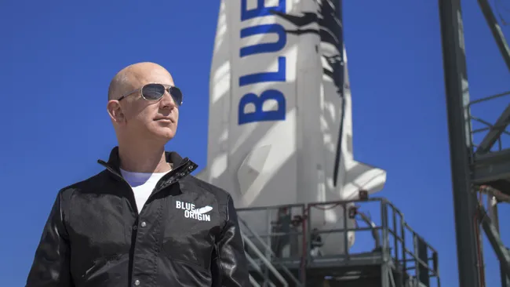

<!-- .element: class="r-stretch" -->
 
<audio controls src="parable/assets/Tasmin Archer - Sleeping Satellite - 01.mp3"></audio>

# Parable of the Sower
<!-- .element: class="r-fit-text" -->
## Afrofuturism and the End of the World
<!-- .element: class="r-fit-text" -->

<small>*Dr. Sample*  
*March 2024*</small>

Note: Humes Plenary, March 28, 2024

# What is Science Fiction?
<!-- .element: class="r-fit-text" -->
Note: What I really mean to ask is, what's the function of science fiction?

Preparation for the future?
<!-- .element: class="r-fit-text" -->
Note: H.G. Wells and Jules Verne

Warning about the future?
<!-- .element: class="r-fit-text" -->

<!-- .element: class="r-stretch" -->
Note: Snow Crash by Neal Stephenson (1992) coined the term “metaverse”. Borrowed by Zuckerberg for his VR push. Or, a few years ago Black Mirror episode "Be Right Back" warned against using AI to create artificial versions of our dead loved ones, a tech companies are actively now developing.

Really about the present?
<!-- .element: class="r-fit-text" -->
Science Fiction can defamiliarize the present.<!-- .element: class="fragment" -->

Note: So many things and experiences in our daily life are totally habituated, totally naturalized—so many things go without saying because they come without saying, it’s what we call ideology. Ideology refers to the beliefs you don't even realize are beliefs, beliefs you think are totally natural. (Lauren recognizes this: “we hear gunfire so much that we don’t hear it” (44)) 

“humankind…is able to bear very little  
of the unmediated, unfiltered experience  
of the daily life of capitalism”
<!-- .element: class="r-fit-text" -->

<small>Fredric Jameson, “Progress Versus Utopia; or, Can We Imagine the Future?”   
*Science Fiction Studies* 9 (1982)</small>
<!-- .element: class="fragment" -->

Note: SF distracts us from our defense mechanisms against that reality; SF is a strategy of indirection that allows us to look awry at the real conditions of our world. 

Our present becomes the past  
of some unexpected future.
<!-- .element: class="r-fit-text" -->

Note: Science fiction transforms our present into the past of some unexpected future; our present becomes history and dramatizes our failure to imagine a more equitable future. See page 63 of Parable of the Sower. In a 1994 interview, Butler said, "There isn’t anything in there that can’t happen if we keep going as we have been…And the horrible thing is some of them are happening already anyway. (Crisis April 1994)

# Judging a Book by Its Cover
<!-- .element: class="r-fit-text" -->

Note: Butler says she has three general audiences: the science-fiction audience, the black audience, and the feminist audience (SFS 23, 1996)

## Paratext  

<q>the zone between text and off-text</q>
<!-- .element: class="fragment" -->
Gérard Genette (1997)
<!-- .element: class="fragment" -->
Note: Boundary space between the inside and outside of a text, shapes the reception of a text, our expectations and attitudes toward it.

<!-- .element: class="r-stretch" -->
(1993)

<!-- .element: class="r-stretch" -->
(1995)

<!-- .element: class="r-stretch" -->
(2000)

<!-- .element: class="r-stretch" -->
(2016)

<!-- .element: class="r-stretch" -->
(2019)

  
   
  

  
   

<!-- .element: class="r-stretch" -->

# Afrofuturism
<!-- .element: class="r-fit-text" -->

“Afrofuturism” coined by cultural critic Mark Dery in a 1994 essay and set of interviews called “Black to the Future”<!-- .slide: style="text-align: left" -->

“African Americans, in a very real sense, are the descendants of alien abductees; they inhabit a sci-fi nightmare in which unseen but no less impassable force fields of intolerance frustrate their movements; official histories undo what has been done; and technology is too often brought to bear on black bodies (branding, forced sterilization, the Tuskegee experiment, and tasers)”<!-- .slide: style="text-align: left" -->

“Can a community whose past has been deliberately rubbed out…imagine possible futures?”<!-- .slide: style="text-align: left" -->

# Hallmarks of Afrofuturism
<!-- .element: class="r-fit-text" -->

* Combines pop culture, science fiction, historical fiction, fantasy, magic realism, and non-Western or African-centric experiences  
<!-- .element class="fragment highlight-current-red" -->
 
* Reintegrates people of color into science fiction and pop culture 
<!-- .element class="fragment highlight-current-red" -->

* Explores role of science and technology in black lives
<!-- .element class="fragment highlight-current-red" -->

* Thinks through the implications of W.E.B. DuBois’ idea of “double-consciousness” in contemporary life<!-- .element class="fragment highlight-current-red" -->

* Draws parallels between transatlantic slave trade and contemporary and futuristic power relations<!-- .element class="fragment highlight-current-red" -->

* Imagining possible futures in a way that centers blackness and black experiences  <!-- .element class="fragment highlight-current-red" -->

Note: Does Parable of the Sower do any of these three?

# Space is a Place in *Parable of the Sower*
<!-- .element: class="r-fit-text" -->

*The Destiny of Earthseed  
Is to take root among the stars.*
<!-- .element: class="r-fit-text" -->

Note: p. 84-85. "We have to seed ourselves away from this dying place" (78). "There are living worlds just a few light years away, and the United States is busy drawing back from even our nearby dead worlds. I understand why they are, but I with they weren't" (83). Questions for the students: do you agree with Lauren or her father (who calls space exploration a "criminal waste of time and money" on page 20)? 

<!-- .element: class="r-stretch" -->
Gil Scott-Heron  
"Whitey On the Moon"  (1970)  
<audio controls src="parable/assets/Gil Scott-Heron - Whitey On the Moon.mp3"></audio>

# What Wants to Go to Space Now?
<!-- .element: class="r-fit-text" -->

  
  <!-- .element: class="fragment" -->

  
  <!-- .element: class="fragment" -->

# How Long Is the Future <!-- .element: class="r-fit-text" -->
# And Who Will Survive It? <!-- .element: class="r-fit-text" -->
<small>*Dr. Sample*  
*April 2024*</small>

# Research is Work 
<!-- .element: class="r-fit-text fragment" -->
Not Thinking
<!-- .element: class="r-fit-text fragment" -->
Notes: Meeting with my section, talking with the other faculty, and one thing I'm realizing is that you all have a tendency to think. Which should be a good thing, right? But you're skipping a step. Instead of thinking right now, you ought to be working. Going to share a few thoughts on the difference between thinking and working that one of my own professors, Peter Stallybrass, once shared with me.

## Thinking is
* Hard  <!-- .element: class="fragment fade-in-then-semi-out" -->
* Painful   <!-- .element: class="fragment fade-in-then-semi-out" -->
* Boring  <!-- .element: class="fragment fade-in-then-semi-out" -->
* Repetitious  <!-- .element: class="fragment fade-in-then-semi-out" -->
* Indolent <!-- .element: class="fragment fade-in-then-semi-out" -->

## Working is
* Easy  <!-- .element: class="fragment fade-in-then-semi-out" -->
* Challenging  <!-- .element: class="fragment fade-in-then-semi-out" -->
* Pleasurable <!-- .element: class="fragment fade-in-then-semi-out" -->
* Exciting  <!-- .element: class="fragment fade-in-then-semi-out" -->
* Process of Discovery  <!-- .element: class="fragment fade-in-then-semi-out" -->

## To work you have to
* Do the work  <!-- .element: class="fragment fade-in-then-semi-out" -->
* Read/view/listen/play  the thing you’re working on  <!-- .element: class="fragment fade-in-then-semi-out" -->
  

<!-- .element: class="r-stretch" -->

# You can’t do the work until you do the work.

# How Long Is the Future <!-- .element: class="r-fit-text" -->
# And Who Will Survive It? <!-- .element: class="r-fit-text" -->

# How Long  
# is the Future?
Notes: Which is really just a way of asking, how long is our future, the future of humanity. 

<!-- .element: class="r-stretch" -->
Notes: Early last semester we read the philosopher Amy Schneiderman. At one point Schneiderman makes the point that compared to the rest of the universe, to even just the earth, humanity is in its infancy. She observes that if the lifespan of the Earth were a clock, humans arrived "a fraction of an instant before midnight at the end of the twenty-four hours." We are young. And we are fantastically conceptualizing time spans longer than a generation or two.

<section data-background-iframe="https://longnow.org/"
          data-background-interactive>
</section>
Notes: Click on Clock > Summary > Motivations

<!-- .element: class="r-stretch" -->
Notes: Original Macintosh desktop icons from 1984. Designed by artist Susan Kare, an artist at Apple (employee #11). Designed whole visual iconography of the Mac, including the default font, Chicago.

<!-- .element: class="r-stretch" -->
Notes: 32x32 monochrome grid. So a total of 1024 pixels to work with.

<section data-background-iframe="http://numeral.com/projects/web/everyIcon/everyIcon.php"
          data-background-interactive>
</section>
Notes: released on January 27, 1997 and still running. 100 icons per second. Took over a year for first cell of second row to switch on

# 21024

# 1.8 x 10308

179,769,313,486,231,590,772,930,519,078,902,  
473,361,797,697,894,230,657,273,430,081,157,  
732,675,805,500,963,132,708,477,322,407,536,  
021,120,113,879,871,393,357,658,789,768,814,  
416,622,492,847,430,639,474,124,377,767,893,  
424,865,485,276,302,219,601,246,094,119,453,  
082,952,085,005,768,838,150,682,342,462,881,  
473,913,110,540,827,237,163,350,510,684,586,  
298,239,947,245,938,479,716,304,835,356,329,  
624,224,137,216
Notes: There's no name for a number this big

<section data-background-iframe="http://numeral.com/projects/web/everyIcon/everyIcon.php"
          data-background-interactive>
</section>
Notes: 5.85 billion years to finish second line
Most astronomers give the sun about 5 billion more years (1 billion before it starts boiling the oceans)

# Who Will Survive the Future?
Notes: One of the connections between *Parable of the Sower* and *Children of Men* is that they take place in our now, more or less. They imagine a near future in which many do not survive.

<section data-background-iframe="https://davidsoncoding.github.io/parable_of_the_sower/"
          data-background-interactive>
</section>

## What does the map tell us about our collective apocalyptic imagination?

Notes: Any themes in the news stories? Common occurrences? Common places?

# What’s the time horizon for hopelessness?

When would you start to feel hopeless or that life is meaningless? Knowing that humanity will die out in...
* 5000 years <!-- .element: class="fragment fade-in-then-semi-out" -->
* 1000 years <!-- .element: class="fragment fade-in-then-semi-out" -->
* 500 years <!-- .element: class="fragment fade-in-then-semi-out" -->
* 100 years <!-- .element: class="fragment fade-in-then-semi-out" -->
* 50 years <!-- .element: class="fragment fade-in-then-semi-out" -->
* 10 years <!-- .element: class="fragment fade-in-then-semi-out" -->
* 1 years <!-- .element: class="fragment fade-in-then-semi-out" -->

# Who Will Survive the Future?

<section data-background-iframe="https://ahfarms.org/"
          data-background-interactive>
</section>