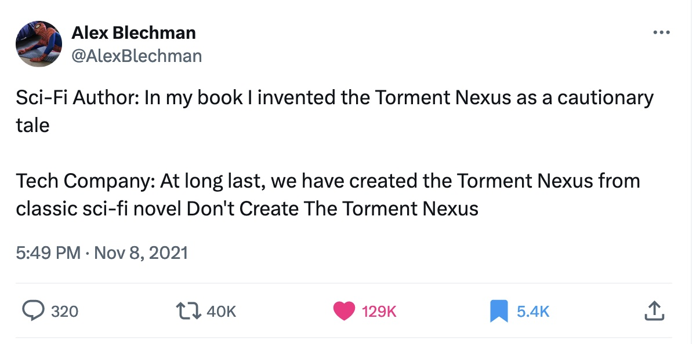
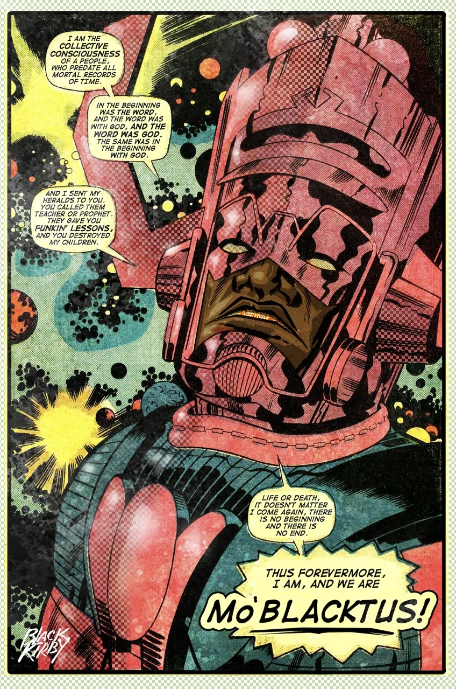

# Parable of the Sower
<!-- .element: class="r-fit-text" -->
## Afrofuturism and the End of the World
<!-- .element: class="r-fit-text" -->

<small>*Dr. Sample*  
*March 2024*</small>

Note: speaker notes FTW!

# What is Science Fiction?
<!-- .element: class="r-fit-text" -->

Preparation for the future?
<!-- .element: class="r-fit-text" -->

Warning about the future?
<!-- .element: class="r-fit-text" -->

<!-- .element: class="r-stretch" -->

Really about the present?
<!-- .element: class="r-fit-text" -->
Note: page 63 of Parable of the Sower

# Judging a Book by Its Cover
<!-- .element: class="r-fit-text" -->

## Paratexts  

<q>the zone between text and off-text</q>
<!-- .element: class="fragment" -->
Gérard Genette (1997)
<!-- .element: class="fragment" -->

<!-- .element: class="r-stretch" -->
(1993)

<!-- .element: class="r-stretch" -->
(1995)

<!-- .element: class="r-stretch" -->
(2000)

<!-- .element: class="r-stretch" -->
(2016)

<!-- .element: class="r-stretch" -->
(2019)

  
   
  

  
   

<!-- .element: class="r-stretch" -->

# Afrofuturism
<!-- .element: class="r-fit-text" -->

“Afrofuturism” coined by cultural critic Mark Dery in a 1994 essay and set of interviews called “Black to the Future”<!-- .slide: style="text-align: left" -->

“African Americans, in a very real sense, are the descendants of alien abductees; they inhabit a sci-fi nightmare in which unseen but no less impassable force fields of intolerance frustrate their movements; official histories undo what has been done; and technology is too often brought to bear on black bodies (branding, forced sterilization, the Tuskegee experiment, and tasers”<!-- .slide: style="text-align: left" -->

“Can a community whose past has been deliberately rubbed out…imagine possible futures?”<!-- .slide: style="text-align: left" -->

# Hallmarks of Afrofuturism
<!-- .element: class="r-fit-text" -->

Reintegrates people of color into science fiction and pop culture

Combines pop culture, science fiction, historical fiction, fantasy, magic realism, and non-Western or African-centric experiences

Imagining possible futures in a way that centers blackness and black experiences

Explores role of science and technology in black lives

Thinks through the implications of W.E.B. DuBois’ idea of “double-consciousness” in the digital age

Draws parallels between transatlantic slave trade and contemporary and futuristic power relations

Imagines utopias set apart from the everyday dystopia of black lives

# Black Kirby

Note: Stacey Robinson and John Jennings, remimagining Jack Kirby's work through the lens of Afrofuturism

<!-- .element: class="r-stretch" -->

<!-- .element: class="r-stretch" -->

Note: Last name comes from Ghanian word that means "go back and get it"

<!-- .element: class="r-stretch" -->

<!-- .element: class="r-stretch" -->
Gil Scott-Heron  
"Whitey On the Moon"  (1970)  
<audio controls src="assets/Gil Scott-Heron - Whitey On the Moon.mp3"></audio>

