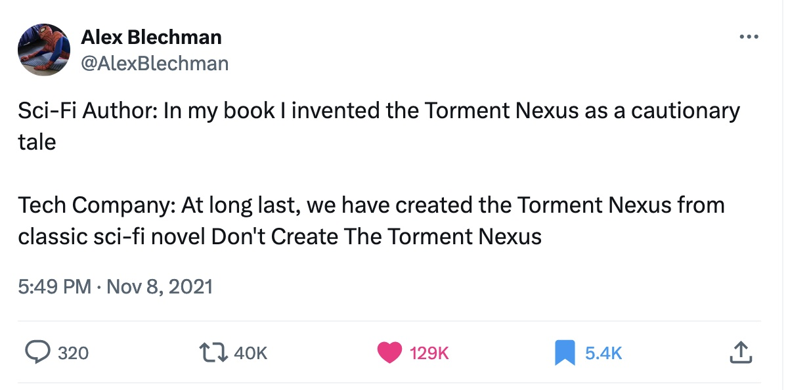
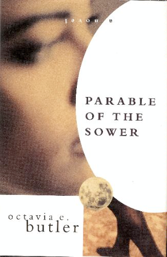
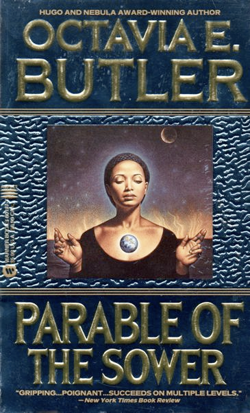
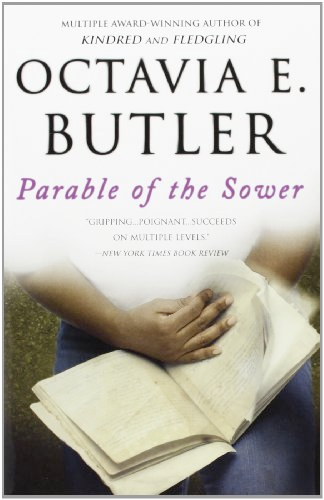
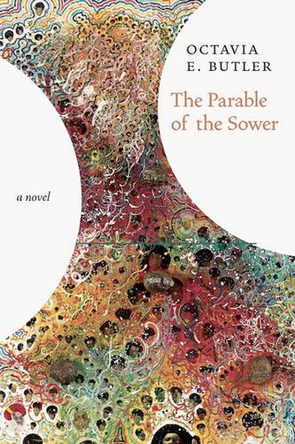
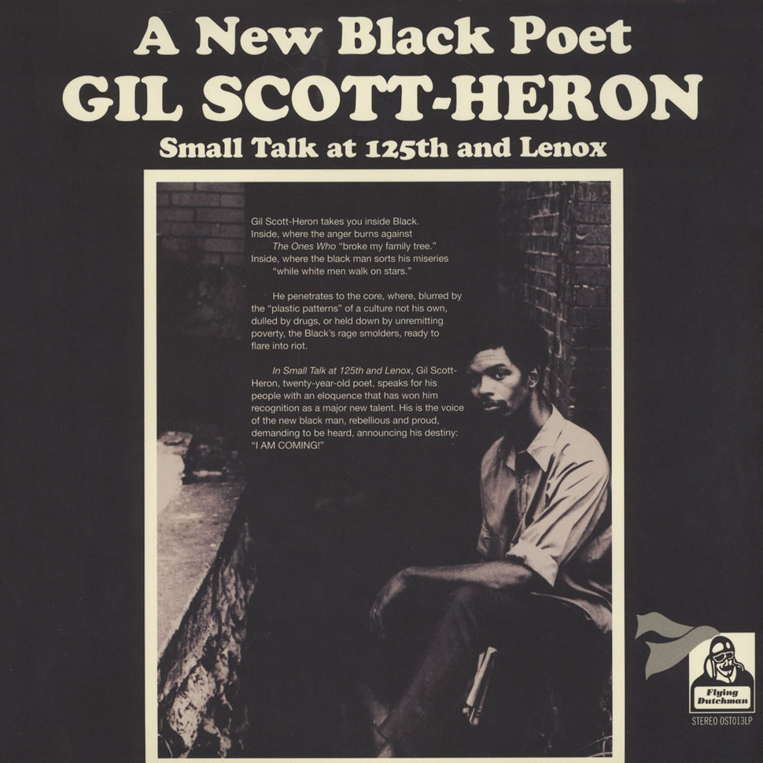

# Parable of the Sower
<!-- .element: class="r-fit-text" -->
## Afrofuturism and the End of the World
<!-- .element: class="r-fit-text" -->

<small>*Dr. Sample*  
*March 2024*</small>

Note: Humes Plenary, March 28, 2024

# What is Science Fiction?
<!-- .element: class="r-fit-text" -->

Note: H.G. Wells and Jules Verne

Preparation for the future?
<!-- .element: class="r-fit-text" -->

Warning about the future?
<!-- .element: class="r-fit-text" -->

<!-- .element: class="r-stretch" -->

Really about the present?
<!-- .element: class="r-fit-text" -->
Science Fiction can defamiliarize the present.<!-- .element: class="fragment" -->
Note: So many things and experiences in our daily life are totally habituated, totally naturalized—so many things go without saying because they come without saying, it’s what we call ideology (Lauren recognizes this: “we hear gunfire so much that we don’t hear it” (44))
page 63 of Parable of the Sower. 

“humankind…is able to bear very little  
of the unmediated, unfiltered experience  
of the daily life of capitalism”
<!-- .element: class="r-fit-text" -->

<small>Fredric Jameson, “Progress Versus Utopia; or, Can We Imagine the Future?”   
*Science-Fiction Studies* 9 (1982)</small>
<!-- .element: class="fragment" -->

Note: SF distracts us from our defense mechanisms against that reality; SF is a strategy of indirection that allows us to look awry at the real conditions of our world. Science fiction transforms our present into the past of some unexpected future; our present becomes history and dramatizes our failure to imagine a more equitable future

# Judging a Book by Its Cover
<!-- .element: class="r-fit-text" -->

Note: Butler says she has three general audiences: the science-fiction audience, the black audience, and the feminist audience (SFS 23, 1996)

## Paratext  

<q>the zone between text and off-text</q>
<!-- .element: class="fragment" -->
Gérard Genette (1997)
<!-- .element: class="fragment" -->

<!-- .element: class="r-stretch" -->
(1993)

<!-- .element: class="r-stretch" -->
(1995)

<!-- .element: class="r-stretch" -->
(2000)

<!-- .element: class="r-stretch" -->
(2016)

<!-- .element: class="r-stretch" -->
(2019)

  
   
  

  
   

<!-- .element: class="r-stretch" -->

# Afrofuturism
<!-- .element: class="r-fit-text" -->

“Afrofuturism” coined by cultural critic Mark Dery in a 1994 essay and set of interviews called “Black to the Future”<!-- .slide: style="text-align: left" -->

“African Americans, in a very real sense, are the descendants of alien abductees; they inhabit a sci-fi nightmare in which unseen but no less impassable force fields of intolerance frustrate their movements; official histories undo what has been done; and technology is too often brought to bear on black bodies (branding, forced sterilization, the Tuskegee experiment, and tasers)”<!-- .slide: style="text-align: left" -->

“Can a community whose past has been deliberately rubbed out…imagine possible futures?”<!-- .slide: style="text-align: left" -->

# Hallmarks of Afrofuturism
<!-- .element: class="r-fit-text" -->

* Combines pop culture, science fiction, historical fiction, fantasy, magic realism, and non-Western or African-centric experiences  
<!-- .element class="fragment highlight-current-red" -->
 
* Reintegrates people of color into science fiction and pop culture 
<!-- .element class="fragment highlight-current-red" -->

* Explores role of science and technology in black lives
<!-- .element class="fragment highlight-current-red" -->

* Thinks through the implications of W.E.B. DuBois’ idea of “double-consciousness” in contemporary life<!-- .element class="fragment highlight-current-red" -->

* Draws parallels between transatlantic slave trade and contemporary and futuristic power relations<!-- .element class="fragment highlight-current-red" -->

* Imagining possible futures in a way that centers blackness and black experiences  <!-- .element class="fragment highlight-current-red" -->

Note: Does Parable of the Sower do any of these three?

# Space is a Place in *Parable of the Sower*
<!-- .element: class="r-fit-text" -->

*The Destiny of Earthseed  
Is to take root among the stars.*
<!-- .element: class="r-fit-text" -->

Note: p. 84-85. "We have to seed ourselves away from this dying place" (78). "There are living worlds just a few light years away, and the United States is busy drawing back from even our nearby dead worlds. I understand why they are, but I with they weren't" (83). Questions for the students: do you agree with Lauren or her father (who calls space exploration a "criminal waste of time and money" on page 20)? 

<!-- .element: class="r-stretch" -->
Gil Scott-Heron  
"Whitey On the Moon"  (1970)  
<audio controls src="parable/assets/Gil Scott-Heron - Whitey On the Moon.mp3"></audio>

# Imagination in Parable of the Sower